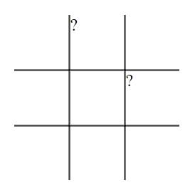
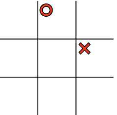

                        ## FIRST GAME OUT OF HTML, CSS AND VAINILLA JS 🕹️

I've choosen to go on a twist on the classic "Mrs Pacman" and created a "Escape the Pacman" version.

It's a very simple game (and still improving!) in wich you have to gather 10 coins points to win without the Pacman catching you.
Be careful of the swords and remember that you are the ghost!

Use WASD to move around.

Enjoy!


## THIS IS A PRACTICAL EXERCISE FOR CODEOP'S FRONTEND BOOTCAMP -- ORIGINAL INSTRUCCTIONS ⬇️


_#DOM project_

_En aquesta activitat crearàs un joc el DOM, HTML i CSS._

_## Objectius_

_- Manipular el DOM directament, afegint i eliminant elements._
_- Fer servir CSS per donar estils als elements de la pàgina._
_- Afegir gestors d'esdeveniments (event handlers) per interactuar amb les accions que l'usuari faci a la pàgina._
_- Gestionar les dades del joc de manera ordenada i estructurada, separades de la visualització_
_- Implementar la lògica de funcionament del joc de manera ordenada i estructurada, dividint el codi en tantes funcions com calgui._
_- Separar la lògica de funcionament del codi de la visualització._

_## Configuració_

_- `npm install` per instal·lar Tailwind CSS._
_- `npm start` per a inicialitzar el compilador de Tailwind CSS._
_- Obre `index.html` al navegador amb el Live Server de VS Code._

_## Basic requirements_

_- Desenvolupa el joc utilitzant tot el que has après de HTML, CSS, JavaScript i el DOM._
_- Si ho prefereixes, pots fer un altre joc._
_- Crea un grid pel tic tac toe en `HTML`_
_- El estil ha de ser semblant al que es mostra a l'image `pas3.PNG`_
_- Fes servir JavaScript per mostrar l' "x" i el "o" al grid._

_## Tres en ratlla_

_## 1. Primera Part_

_- [ ] Afegiu l'HTML necessari_

  _- Haurieu de crear el `<div>` necessari pel comptador._

_- [ ] Afegiu el CSS necessari:_

  _- El comptador ha d'estar centrat a la pàgina._
 _ - Traieu els costats innecessaris._ 
  _- Feu-ho el més semblant possible a un taulell de tres en ratlla._

 _

_- [ ] Afegiu contingut_

  _- Utilitzeu pseudoelements per afegir X's i O's als quadres_
  _- Al vostre arxiu Css, afegiu el següent:_

    ```css
    .x::after {
      content: "?";
    }
    .o::after {
      content: "?";
    }
    ```

    _Ara, reemplacem "?" pels icones "❌" i "⭕" tal com es veu a la imatge de sota._


    

    ```css
    .x::after {
      content: "❌";
    }
    .o::after {
      content: "⭕";
    }
    ```

 _   _El fragment de codi CSS anterior significa que cada vegada que apliquem una classe de .x o .o a una de les cel·les, es marcarà.__
    
    
_- [ ] Centreu els icones ❌ i ⭕_

  _- Afegiu l'estil CSS per tal que els elements estiguin centralitzats i més grans._

    

  _- [ ] Comproveu que el vostre `CSS` estigui funcionant correctament_
        

_## 2. Afegeix funcionalitat_

_Recordatori: Tota la interactivitat i les funcionalitats haurán d'estar fetes utilitzant funcions de JavaScript._

_- [ ] Feu que el vostre joc s'assembli a la imatge inferior._

  _- Programeu un esdeveniment de clic al grid per marcar les caselles_
  _- Afegiu els checks necessaris (draw, winner)_
  _- Afegiu CSS per desactivar la cel·la després del cli_c


_- Creeu un botó <button>restart</button> amb HTML_
_- Feu que el botó de reinici sigui funcional._

_- [ ] Creeu el joc_

_ Ara centrem la nostra atenció a crear realment el joc en si. Tenim el tauler, tenim l'estil i ara afegirem la lògica. En primer lloc, volem definir un objecte per emmagatzemar l'state del nostre joc:_

  ```js const game = {
      xTurn: true,
      xState: [],
      oState: [],
      winningStates: [
          // Rows
          ['0', '1', '2'],
          ['3', '4', '5'],
          ['6', '7', '8'],

          // Columns
          ['0', '3', '6'],
          ['1', '4', '7'],
          ['2', '5', '8'],

          // Diagonal
          ['0', '4', '8'],
          ['2', '4', '6']
      ]
  }
  ```

_Aquest objecte tindrà 4 propietats diferents:_

_1. `xTurn`, una bandera per intercanviar torns._
_2. `xState`, l'estat de la X, representat amb un array d'strings._
_3. `oState`, l'estat de la Y, representat de la mateixa manera._
_4. `winningStates`, les possibles combinacions per guanyar el joc._

_Com hem aconseguit les possibles combinacions? A partir d'aquests valors, podem enumerar els possibles estats guanyadors aquí. Compararem això amb `xState` i `oState` més endavant per veure qui està guanyant el joc._

_## 3. Doneu-li estil a la pantalla "final del joc"._


_- Creeu una etiqueta de titol HTML `h1` i afegiu al vostre codi els resultats possibles en funció de les coincidències._
_- Assegureu-vos que el botó de reset apareix al final del joc._

_## Recursos_

- [How to Recreate Tic-Tac-Toe in Vanilla JavaScript](https://www.webtips.dev/tic-tac-toe-in-javascript)
- [MDN - Manipulating the DOM Guide](https://developer.mozilla.org/en-US/docs/Learn/JavaScript/Client-side_web_APIs/Manipulating_documents)
- [Plain JS - Common DOM Manipulation methods](https://plainjs.com/javascript/manipulation/)
- [Eloquent JavaScript - The DOM](https://eloquentjavascript.net/14_dom.html)
- [Eloquent JavaScript - Handling Events](https://eloquentjavascript.net/15_event.html)

_## Notes_

_Aquest és un projecte d'estudiant creat a [CodeOp](http://CodeOp.tech), al bootcamp de Front End Development a Barcelona._
